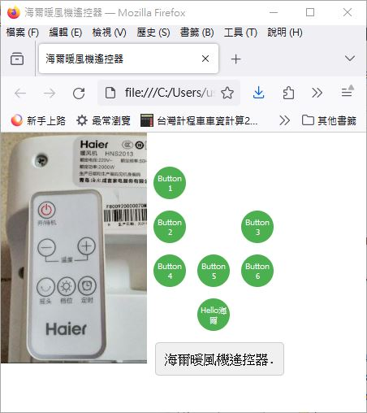

# HaierFan_IR_Remote
webpage of Haier remote control for cell phone, play wave file of IR signal, phone jack output to to drive &amp; emits IR signal  

https://xiaolaba.github.io/HaierFan_IR_Remote/

  
To host your HTML file along with its associated CSS file on GitHub Pages, you need to follow these steps:
### Create a GitHub Repository:
If you haven't already, create a new repository on GitHub.
Name it appropriately, such as "HaierFan_IR_Remote".

### Upload Your Files:  
Upload your index.html, script.js and style.css files to this repository. You can do this directly through the GitHub website or using Git commands locally.  

### Enable GitHub Pages:
Go to your repository's settings tab.
Scroll down to the "GitHub Pages" section.
Choose the branch where your HTML file resides. Typically, you'd choose the main branch.
Set the folder to / or /docs if you have your files in a folder.
Save your settings.

### Access Your Site:
After saving the settings, GitHub will provide you with a URL where your site is hosted. It usually follows this format: 
```
https://<username>.github.io/<repository-name>
```
In your case, it will be something like 
```https://<username>.github.io/HaierFan_IR_Remote```

### Optional: Custom Domain (if needed):
If you have a custom domain, you can configure it to point to your GitHub Pages site by following the instructions in the GitHub Pages settings.
